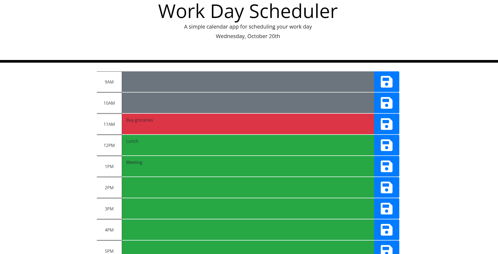

# Daily-planner

<a href="https://raealejandrino.github.io/Daily-planner/">Daily Planner Link</a>

## The Repository

This repository is where I (Rae Alejandrino) write and implement a typical work day scheduler using Jquery and bootstrap.

## Work Day Scheduler

In this repository, you can find a <a href="https://raealejandrino.github.io/Daily-planner/">live</a> url deployment of a working work day scheduler. Upon visiting the web address, you can click on any timeblocks to input a task for that specific hour. To save your task, click on the corresponding save icon to the right of the timeblock. In addition to tracking your saved tasks, each timeblock is conveniently color-coded to match whether a specific timeblock is passed, current, or in the future. 